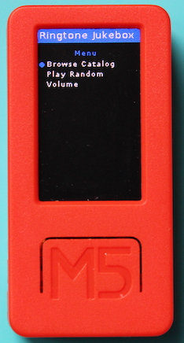
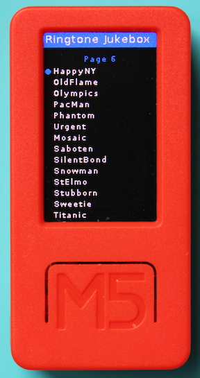
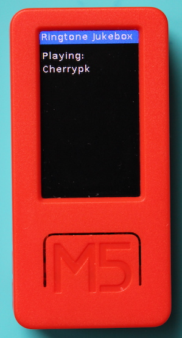
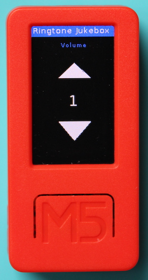
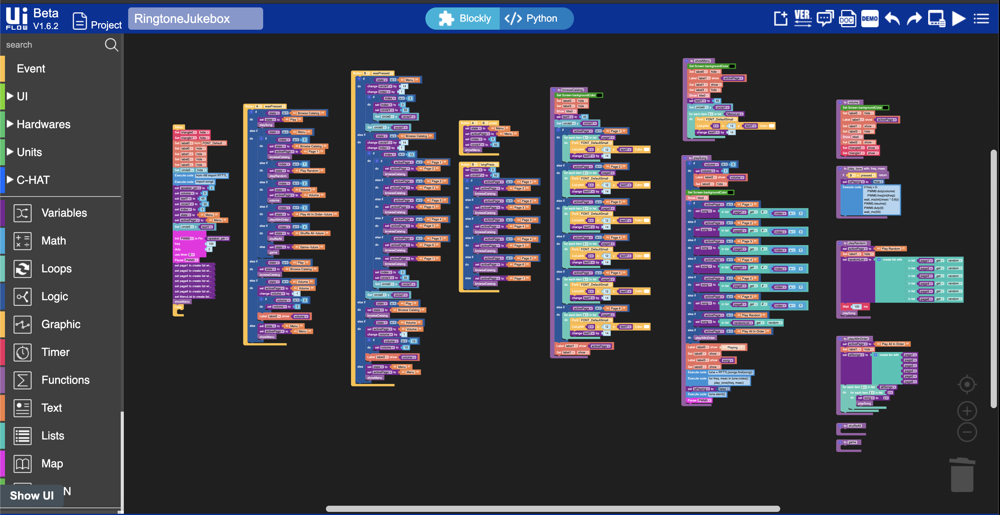

# M5StickC-Plus-Ringtone-Jukebox
The Ringtone Jukebox is a front end interface for the M5StickC Plus that allows playing of RTTTL (Ringtone Text Transfer Language) ringtones/tunes/jingles/songs via the internal buzzer of the hardware. It was inspired by Dave Hyland's RTTTL parser, which he contributed to the MicroPython forum in July 2016. You can read the topic here:
https://forum.micropython.org/viewtopic.php?f=14&t=2172&p=12291

-----------------------------------------------------------------
### Objective
The objective of this project was to implement the RTTTL functionality using the M5Stack uiFlow Blockly IDE and create a user interface for the ringtones. My goal was to use as many native, non-customized blocks as I could. But in reality, there are limitations and bugs with the uiFlow IDE, in which I had to use a few **execute** blocks to workaround those issues.

-----------------------------------------------------------------

### Current Functionality
+ Browse a catalog of ringtones (6 pages), select the ringtone, and play it.
+ Play a random ringtone
+ Set the volume

### Future Functionality (WIP)
+ Play all ringtone in consecutive order
+ Shuffle all ringtones
+ "Name that tune" game mode with players and score tracking

-----------------------------------------------------------------

### Installation Instructions
1. Copy rtttl.py and songs.py to the M5StickC Plus device using Adafruit ampy CLI tool (preferred), Thonny IDE, or Mu IDE and put them in the /flash directory
2. Using your browser (Chrome is preferred), go to the web uiFlow IDE at https://flow.m5stack.com
3. Open RingtoneJukebox.m5f using the menu in the upper right of the IDE
4. Run the program (using the Play button) or Download the program (using the Download option in the IDE menu) to your M5StickC Plus device

-----------------------------------------------------------------

## Navigation Instructions
*NOTE:* There are 3 buttons on the M5StickC Plus. Power/Reset on the left side, Button A (labeled M5) on the front, and Button B on the right side.

After the program loads, the user is presented with the Menu.

### Menu
  
+ Press Button B to move the selection dot down the list. It will wrap back to the top after the last menu item.
+ Press Button A to select that menu item.

### Browse Catalog
  
+ Press Button B to move the selection dot down the list. It will go to the next page after the last ringtone on the current page. After the last ringtone on page 6 it will wrap back to page 1.
+ Long press Button B (for 2 seconds) to skip to the next page of the catalog
+ Press Button A to play your selection. When a ringtone is playing, press Button B to stop the ringtone and return to the previous menu.

  
+ To get back to the menu from the catalog, press Button A and Button B simultaneously

### Volume
  
+ Press Button B to increase the volume
+ Press Button A to decrease the volume
+ Press Button A and Button B simultaneously to save the volume setting and go back to the menu

-----------------------------------------------------------------

#### uiFlow

-----------------------------------------------------------------

#### To update a ringtone
+ Copy and replace the ringtone code into songs.py for the ringtone that you want to update. 
+ Copy the updated songs.py file to the M5StickC Plus device
+ Update the ringtone's title in one of the page1 through page6 list definitions in the Setup block (*note:* right-click the block and click "Expand Block" to see the list of titles)
+ Run/Download the program on the M5StickC Plus

-----------------------------------------------------------------

## Background Information
The RTTTL specification is described here in detail:

https://www.mobilefish.com/tutorials/rtttl/rtttl_quickguide_specification.html

http://www.convertyourtone.com/rtttl.html

Many more sample ringtones can be found here:  http://www.convertyourtone.com/ringtones.html

